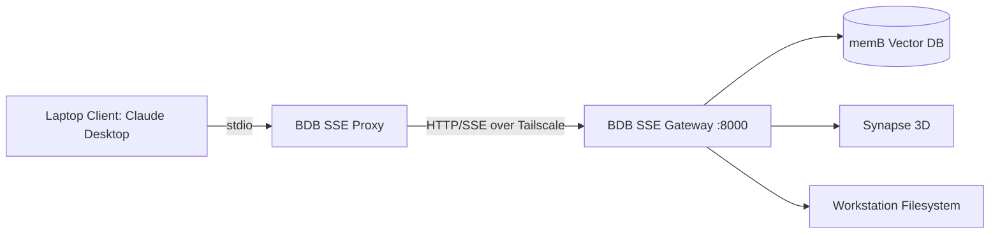

# Architecture & Technical Design

## Protocol & Network Topology
- **Network Layer**: Encrypted Tailscale WireGuard Mesh (P2P Zero-Trust).
- **Transport Layer**: HTTP Server-Sent Events (SSE) for downstream events + HTTP POST for upstream JSON-RPC.
- **Protocol**: Model Context Protocol (MCP) spec 2024-11-05.

## Why SSE over SSH on Windows
1. **CRLF/LF Consistency**: Windows OpenSSH defaults to CRLF line breaks which breaks JSON-RPC parsers. HTTP/SSE ensures standard UTF-8 stream handling.
2. **Character Escaping**: CMD.exe mangles JSON quotes in SSH commands. HTTP POST sends pristine JSON payloads.
3. **Bandwidth**: Consumes < 5 KB/s over cellular connections.
