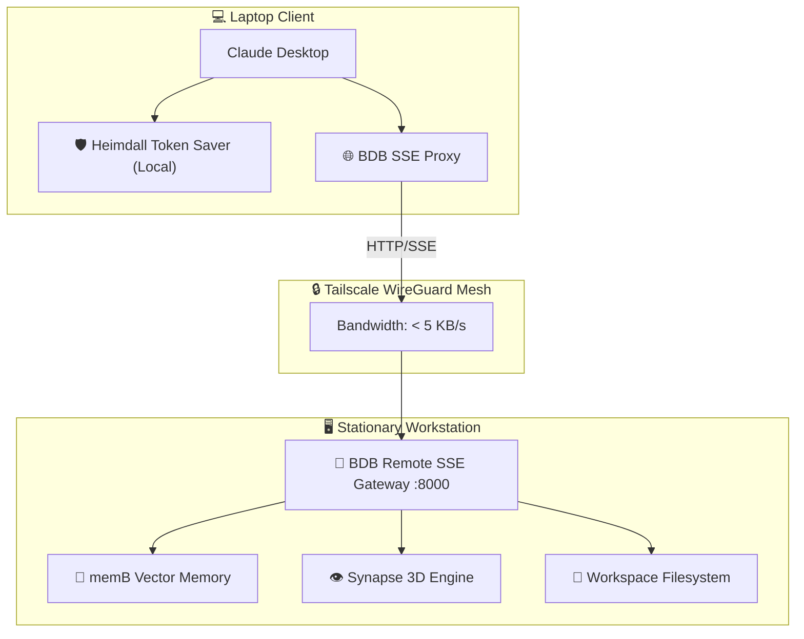

# @hybridlabor-api/bdb-os-remote

[](https://www.npmjs.com/package/@hybridlabor-api/bdb-os-remote)
[](https://github.com/hybridlabor-api/bdb-os-remote/actions/workflows/ci.yml)
[](https://opensource.org/licenses/MIT)

> **Zero-Trust SSE Gateway & Mobile Thin-Client Bridge** for Claude Desktop, Claude Code, and AI Agents over Tailscale.

Work on your stationary workstation directly from your mobile laptop (e.g. on an ICE train) with **zero latency**, **under 5 KB/s bandwidth**, and **full access to all 152 BDB skills, memB vector memory, and workstation compute**.

---

## ⚡ Quick Start

### 1. Interactive Installer (Recommended)
Run the wizard on either machine:
```bash
npx @hybridlabor-api/bdb-os-remote installer
```
- Select **`[1] Workstation`** on your desktop.
- Select **`[2] Laptop`** on your laptop (configures `claude_desktop_config.json` automatically).

---

### 2. Manual CLI Commands

#### Start Server (on Workstation)
```bash
npx @hybridlabor-api/bdb-os-remote server --port 8000
```

#### Run Client Proxy (inside Claude Desktop on Laptop)
```bash
npx @hybridlabor-api/bdb-os-remote client --host noah-workstation --port 8000
```

#### Clone Project (Offline Fallback for Long Tunnels)
```bash
npx @hybridlabor-api/bdb-os-remote pull <project-name>
```

#### Check Gateway Health
```bash
npx @hybridlabor-api/bdb-os-remote status --host noah-workstation
```

---

## 🏗️ Architecture



---

## 🔒 Security & Requirements
- **Tailscale**: Both machines must be logged into the same Tailscale network.
- **No Open Ports**: Zero public port forwardings needed; protected by WireGuard encryption.
- **Node.js**: Requires Node.js >= 18.0.0.

## 📖 Documentation
Detailed technical documentation and architecture decisions are available in [.openwiki/quickstart.md](.openwiki/quickstart.md).

## 📄 License
MIT © BDB Dev Team
