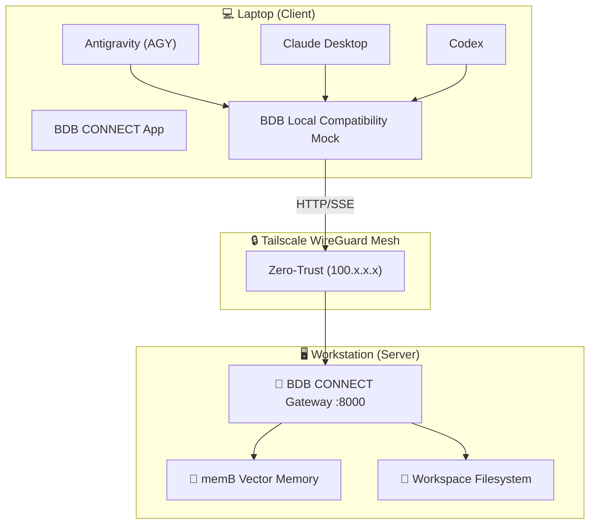

```text
██████╗ ██████╗ ██████╗     ██████╗ ███████╗███╗   ███╗ ██████╗ ████████╗███████╗
██╔══██╗██╔══██╗██╔══██╗    ██╔══██╗██╔════╝████╗ ████║██╔═══██╗╚══██╔══╝██╔════╝
██████╔╝██║  ██║██████╔╝    ██████╔╝█████╗  ██╔████╔██║██║   ██║   ██║   █████╗  
██╔══██╗██║  ██║██╔══██╗    ██╔══██╗██╔══╝  ██║╚██╔╝██║██║   ██║   ██║   ██╔══╝  
██████╔╝██████╔╝██████╔╝    ██║  ██║███████╗██║ ╚═╝ ██║╚██████╔╝   ██║   ███████╗
╚═════╝ ╚═════╝ ╚═════╝     ╚═╝  ╚═╝╚══════╝╚═╝     ╚═╝ ╚═════╝    ╚═╝   ╚══════╝
                               O P T I M I Z E D   A G E N T   S K I L L S
```
# 🌐 BDB CONNECT (v2.0) - Zero-Trust Tailscale Gateway

[](https://www.npmjs.com/package/@hybridlabor-api/bdb-os-remote)
[](https://github.com/hybridlabor-api/bdb-os-remote/actions/workflows/build-crossplatform.yml)
[](https://opensource.org/licenses/MIT)
[](https://tailscale.com/)

> **The Identity-Aware Proxy & Native Menubar App** for remote execution of Antigravity (AGY), Codex, and Claude Desktop over Tailscale.

Work on your powerful stationary workstation directly from your mobile laptop (e.g., on an ICE train) with **zero perceived latency**, **under 5 KB/s bandwidth**, and **full access to all workstation compute, 152 BDB skills, and the memB vector memory engine**.

---

## ⚡ Installation & Updates

We recommend using the interactive universal installer. It natively supports macOS, Windows, and Linux.

### 1. Via Native App (macOS, Windows, Linux)
Download the `.dmg`, `.exe` (NSIS), or `.AppImage` directly from the **[GitHub Releases](https://github.com/hybridlabor-api/bdb-os-remote/releases)** page. 

### 2. Via CLI (Universal)
Run the installer wizard on both your Workstation and your Laptop:
```bash
npx @hybridlabor-api/bdb-os-remote@latest installer
```
- **On your Workstation**: Select `[1] Workstation` to start the Gateway.
- **On your Laptop**: Select `[2] Laptop` to configure your agent automatically (supports AGY, Codex, and Claude).

---

## ✨ Was ist neu in v2.0 (BDB CONNECT)?

- 🎛️ **Native Desktop App (Electron):** Ein wunderschönes, rahmenloses Popover-Fenster direkt in deiner macOS Statusleiste oder im Windows System-Tray. Steuere den Server-Status mit einem Klick!
- 🌐 **Cross-Platform:** Voller Support für macOS (`.dmg`), Windows (`.exe`), und Linux (`.AppImage`) via GitHub Actions.
- 🛡️ **Zero-Trust Identity-Aware Proxy:** Der Server prüft bei jedem Request, ob er von einer verifizierten `100.x.x.x` oder `fd7a:...` Tailscale-IP stammt.
- 🔄 **Multi-Agent Support:** Nahtlose Integration für **Antigravity (AGY)**, **Codex / OpenCode**, und **Claude Desktop**.
- 🚀 **Web UI Launcher:** Öffne das BDB OS Agent Workspace Web-Dashboard direkt über den neuen Button im Menüleisten-Fenster.

---

## 🏗️ Architecture



---

## 🔒 Security & Requirements
- **Tailscale**: Both machines must be logged into the same Tailscale network.
- **No Open Ports**: Zero public port forwardings needed; protected by WireGuard encryption.
- **Node.js**: Requires Node.js >= 18.0.0 (if using CLI).

## 📖 Documentation
Detailed technical documentation and architecture decisions are available in [.openwiki/architecture.md](.openwiki/architecture.md).

## 📄 License
MIT © BDB Dev Team
