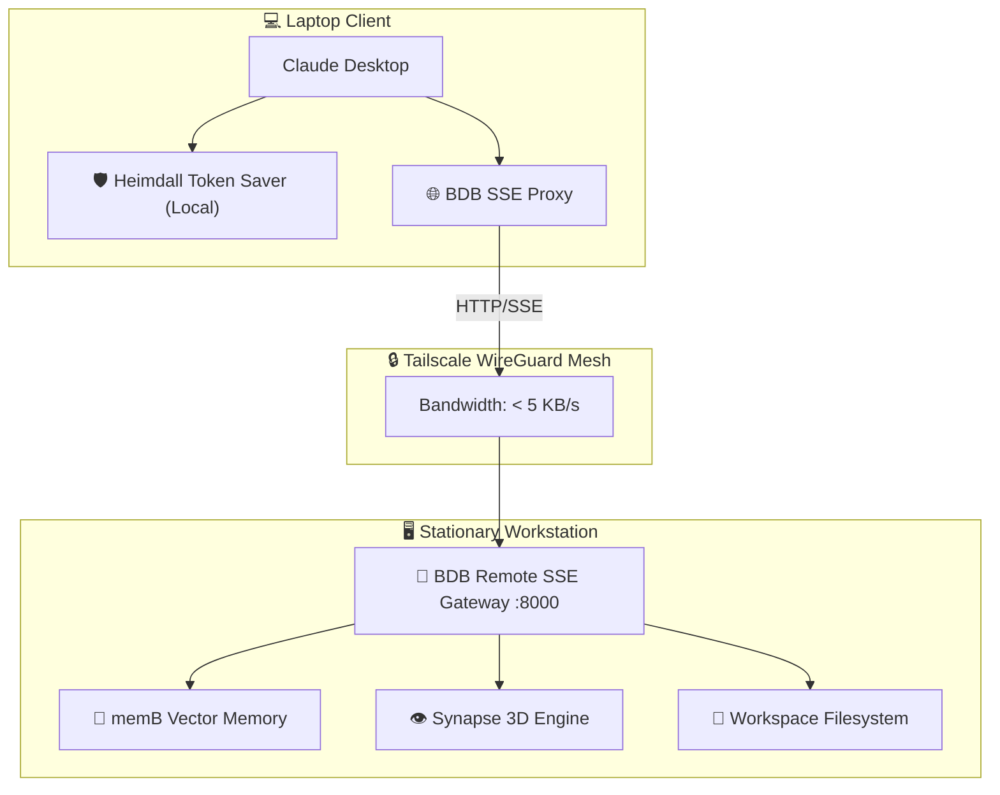

```text
          ██████╗ ██████╗ ██████╗     ██████╗ ███████╗███╗   ███╗ ██████╗ ████████╗███████╗
          ██╔══██╗██╔══██╗██╔══██╗    ██╔══██╗██╔════╝████╗ ████║██╔═══██╗╚══██╔══╝██╔════╝
          ██████╔╝██║  ██║██████╔╝    ██████╔╝█████╗  ██╔████╔██║██║   ██║   ██║   █████╗  
          ██╔══██╗██║  ██║██╔══██╗    ██╔══██╗██╔══╝  ██║╚██╔╝██║██║   ██║   ██║   ██╔══╝  
          ██████╔╝██████╔╝██████╔╝    ██║  ██║███████╗██║ ╚═╝ ██║╚██████╔╝   ██║   ███████╗
          ╚═════╝ ╚═════╝ ╚═════╝     ╚═╝  ╚═╝╚══════╝╚═╝     ╚═╝ ╚═════╝    ╚═╝   ╚══════╝
                         O P T I M I Z E D   A G E N T   S K I L L S - Module
```
# 🌐 BDB OS Remote (Zero-Trust Tailscale SSE Gateway)

[](https://www.npmjs.com/package/@hybridlabor-api/bdb-os-remote)
[](https://github.com/hybridlabor-api/bdb-os-remote/actions/workflows/ci.yml)
[](https://opensource.org/licenses/MIT)
[](https://tailscale.com/)

> **Zero-Trust SSE Gateway & Mobile Thin-Client Bridge** for Claude Desktop, Claude Code, and AI Agents over Tailscale.

Work on your powerful stationary workstation directly from your mobile laptop (e.g., on an ICE train or in a café) with **zero perceived latency**, **under 5 KB/s bandwidth**, and **full access to all workstation compute, 152 BDB skills, and the memB vector memory engine**.

---

## 🚀 The Full BDB Ecosystem
**Note:** `bdb-os-remote` is a powerful standalone tool, but it is part of the larger **BDB Agent OS**. To unlock the ultimate multi-agent capabilities, skill libraries, and advanced Godmode orchestration workflows, check out the core repository:
👉 [**bdb-dev-optimized-agent-skills**](https://github.com/hybridlabor-api/bdb-dev-optimized-agent-skills)

---

## ⚡ Installation & Updates

We recommend using the interactive installer, which handles configuring your Claude Desktop automatically.

### Initial Installation
Run the installer wizard on both your Workstation and your Laptop:
```bash
npx @hybridlabor-api/bdb-os-remote@latest installer
```
- **On your Workstation**: Select `[1] Workstation` to set up the server.
- **On your Laptop**: Select `[2] Laptop` to configure your `claude_desktop_config.json` automatically and point it to the remote machine.

### Updating to the Latest Version
To ensure you have the latest features and security updates, simply run the installer command again:
```bash
npx @hybridlabor-api/bdb-os-remote@latest installer
```
Select the `Update` option when prompted to seamlessly upgrade your setup.

---

## ✨ Features & Function Examples (v1.1.0)

Version 1.1.0 introduces powerful new ways to bridge the gap between your laptop and your workstation:

### 🔀 Standard Multiplexer vs. Config Injector
- **Standard Multiplexer**: Bundles all your remote workstation MCP servers into a single connection. Your laptop only connects to *one* endpoint, and the multiplexer intelligently routes requests to the 100+ individual MCPs running on your workstation.
- **Config Injector**: Prefers granular control? The injector maps individual remote MCPs directly into your local `claude_desktop_config.json`, treating them as discrete remote tools.

### 💾 Offline Cloning (Long Tunnel Fallback)
When traveling through areas with zero cell coverage (like long tunnels), use the Offline Cloning feature. It efficiently pulls a snapshot of your remote project onto your local laptop so you can keep working offline, and syncs back when a connection is restored.
```bash
npx @hybridlabor-api/bdb-os-remote pull <project-name>
```

### 🧠 Asymmetric Token Saving
To keep the SSE proxy lightning fast over weak connections, the gateway leverages **Heimdall Token Saving**. It aggressively minifies payloads over the Tailscale tunnel while expanding them to full context sizes natively on the workstation.

---

## 💬 Prompt Examples for Claude Desktop

Once connected, you can chat with Claude Desktop on your laptop exactly as if you were sitting at your workstation. Try these prompts:

- 🏗️ **"Clone the workstation project 'frontend-v2' to my laptop for offline work."**
- 🧠 **"Scan the remote memB memory for the architecture rules of our event-tech module."**
- 🎮 **"Run the Unreal Engine MCP on my workstation to build the lighting sequence, and summarize the output."**
- ⚙️ **"Trigger the Godmode_Engineering subagent remotely to refactor the database schema on the workstation."**

---

## 🏗️ Architecture



---

## 🔒 Security & Requirements
- **Tailscale**: Both machines must be logged into the same Tailscale network.
- **No Open Ports**: Zero public port forwardings needed; protected by WireGuard encryption.
- **Node.js**: Requires Node.js >= 18.0.0.

## 📖 Documentation
Detailed technical documentation and architecture decisions are available in [.openwiki/quickstart.md](.openwiki/quickstart.md).

## 📄 License
MIT © BDB Dev Team
