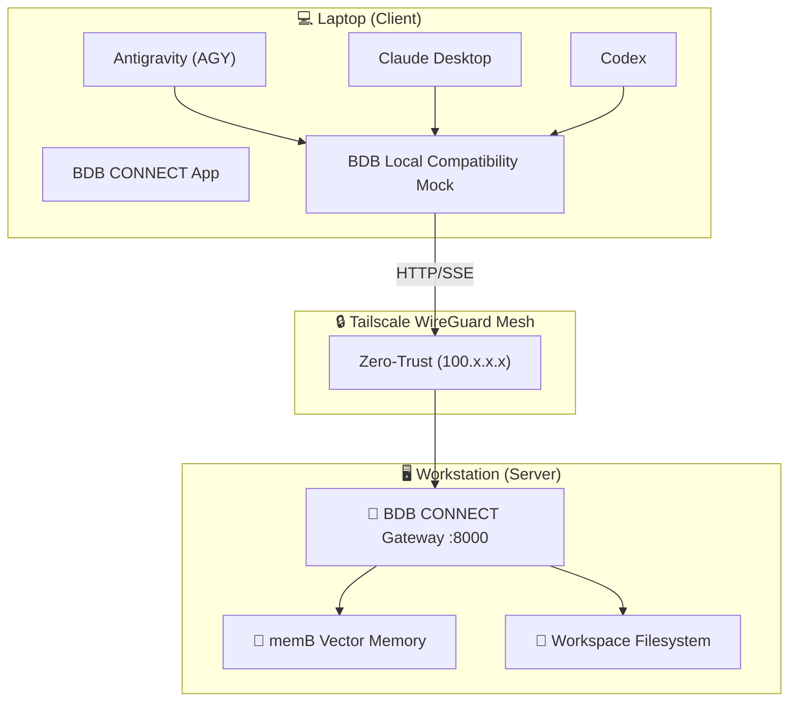

```text
██████╗ ██████╗ ██████╗     ██████╗ ███████╗███╗   ███╗ ██████╗ ████████╗███████╗
██╔══██╗██╔══██╗██╔══██╗    ██╔══██╗██╔════╝████╗ ████║██╔═══██╗╚══██╔══╝██╔════╝
██████╔╝██║  ██║██████╔╝    ██████╔╝█████╗  ██╔████╔██║██║   ██║   ██║   █████╗  
██╔══██╗██║  ██║██╔══██╗    ██╔══██╗██╔══╝  ██║╚██╔╝██║██║   ██║   ██║   ██╔══╝  
██████╔╝██████╔╝██████╔╝    ██║  ██║███████╗██║ ╚═╝ ██║╚██████╔╝   ██║   ███████╗
╚═════╝ ╚═════╝ ╚═════╝     ╚═╝  ╚═╝╚══════╝╚═╝     ╚═╝ ╚═════╝    ╚═╝   ╚══════╝
                               O P T I M I Z E D   A G E N T   S K I L L S
```
# 🌐 BDB CONNECT (v2.0) - Zero-Trust Tailscale Gateway

[](https://www.npmjs.com/package/@hybridlabor-api/bdb-os-remote)
[](https://github.com/hybridlabor-api/bdb-os-remote/actions/workflows/build-crossplatform.yml)
[](https://opensource.org/licenses/MIT)
[](https://tailscale.com/)

> **The Identity-Aware Proxy & Native Menubar App** for remote execution of Antigravity (AGY), Codex, and Claude Desktop over Tailscale.

Work on your powerful stationary workstation directly from your mobile laptop (e.g., on an ICE train) with **zero perceived latency**, **under 5 KB/s bandwidth**, and **full access to all workstation compute, 152 BDB skills, and the memB vector memory engine**.

---

## ⚡ Installation & Downloads

### 1. Download Native Desktop Apps (BDB CONNECT v1.4.0)
Download the standalone installer directly for your operating system:

| Platform | Installer Package | Format | Architecture |
| :--- | :--- | :--- | :--- |
| **Windows** | [📥 **BDB CONNECT Setup 1.4.0.exe**](https://github.com/hybridlabor-api/bdb-os-remote/releases/download/v1.4.0/BDB.CONNECT.Setup.1.4.0.exe) | NSIS Executable | x64 |
| **macOS** | [📥 **BDB CONNECT-1.4.0-arm64.dmg**](https://github.com/hybridlabor-api/bdb-os-remote/releases/download/v1.4.0/BDB.CONNECT-1.4.0-arm64.dmg) | Apple Disk Image | Apple Silicon (M1/M2/M3/M4) |
| **macOS (Zip)** | [📥 **BDB CONNECT-1.4.0-arm64-mac.zip**](https://github.com/hybridlabor-api/bdb-os-remote/releases/download/v1.4.0/BDB.CONNECT-1.4.0-arm64-mac.zip) | Portable Archive | Apple Silicon |

---

### 2. Universal CLI Setup Wizard (One-Click)
Run this single command on either machine to launch the interactive setup wizard:
```bash
npx @hybridlabor-api/bdb-os-remote@latest installer
```

---

## 🔄 The 2-Step Connection Workflow

```text
[Step 1: Workstation (Mac/Linux/PC)] ──────▶ Starts Gateway Daemon (:9080 / :8000)
                                                    │ (Tailscale WireGuard Mesh)
[Step 2: Laptop (Client)]            ──────▶ Connects & Injects AGY / Codex / Claude Config
```

### Step 1: Workstation (Server & Autostart Daemon)
1. Run the installer and choose `[1] Workstation (Server Mode)` to automatically register the background service, or install the native **BDB CONNECT** Menubar App.
2. Or manage the persistent OS autostart daemon directly via CLI:
   ```bash
   # Install and start as a background daemon (LaunchAgent / Windows Scheduled Task)
   npx @hybridlabor-api/bdb-os-remote@latest service install --port 9080 --workspace "/Users/timrennings/bdb-dev"

   # Check daemon status
   npx @hybridlabor-api/bdb-os-remote@latest service status

   # Uninstall daemon
   npx @hybridlabor-api/bdb-os-remote@latest service uninstall
   ```

### Step 2: Laptop (Client)
1. Run the installer on your laptop and choose `[2] Laptop (Client Mode)`.
2. Enter your Workstation's Tailscale IP (e.g. `100.123.207.82`) and Port (`9080`).
3. Select your AI Agent Harness (**Antigravity (AGY)**, **Codex / OpenCode**, or **Claude Desktop**).
4. Verify the tunnel health:
   ```bash
   npx @hybridlabor-api/bdb-os-remote@latest status --host 100.123.207.82 --port 9080
   ```

---

## 🛠️ Troubleshooting & FAQ

### `ECONNREFUSED 100.x.x.x:<port>`
- **Cause**: The Gateway server is not running on the Workstation, or the port numbers do not match.
- **Fix**: Verify on the Workstation that `npx @hybridlabor-api/bdb-os-remote server --port <port>` is active and listening.

### `Windows SSH: Connection refused`
- **Cause**: OpenSSH Server is not installed or the `sshd` service is stopped on Windows.
- **Fix**: Run `npx @hybridlabor-api/bdb-os-remote@latest installer` on Windows. The installer automatically detects missing SSH, prompts for permission, and installs/starts OpenSSH with administrator elevation.

### Verify Tailscale Mesh
- Ensure both devices are on the same Tailscale tailnet:
  ```bash
  tailscale status
  tailscale ping 100.123.207.82
  ```

---

## ✨ Was ist neu in v2.0 (BDB CONNECT)?

- 🎛️ **Native Desktop App (Electron):** Ein wunderschönes, rahmenloses Popover-Fenster direkt in deiner macOS Statusleiste oder im Windows System-Tray. Steuere den Server-Status mit einem Klick!
- 🌐 **Cross-Platform:** Voller Support für macOS (`.dmg`), Windows (`.exe`), und Linux (`.AppImage`) via GitHub Actions.
- 🛡️ **Zero-Trust Identity-Aware Proxy:** Der Server prüft bei jedem Request, ob er von einer verifizierten `100.x.x.x` oder `fd7a:...` Tailscale-IP stammt.
- 🔄 **Multi-Agent Support:** Nahtlose Integration für **Antigravity (AGY)**, **Codex / OpenCode**, und **Claude Desktop**.
- 🚀 **Web UI Launcher:** Öffne das BDB OS Agent Workspace Web-Dashboard direkt über den neuen Button im Menüleisten-Fenster.

---

## 🏗️ Architecture



---

## 🔒 Security & Requirements
- **Tailscale**: Both machines must be logged into the same Tailscale network.
- **No Open Ports**: Zero public port forwardings needed; protected by WireGuard encryption.
- **Node.js**: Requires Node.js >= 18.0.0 (if using CLI).

## 📖 Documentation
Detailed technical documentation and architecture decisions are available in [.openwiki/architecture.md](.openwiki/architecture.md).

## 📄 License
MIT © BDB Dev Team
